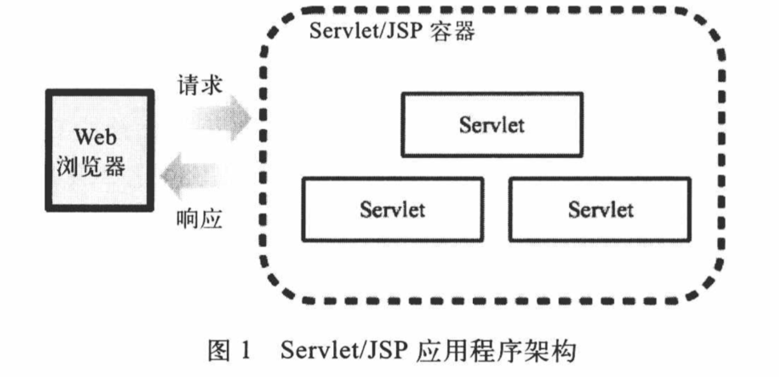

# 0.JavaWeb基础

## 1.Servlet简介

Java Servlet技术简称Servlet,是Java中用于开发Web应用程序的基本技术。

Servlet容器或者Servlet引擎就是一个Web服务器,但它能够生成动态的容器,而不只是提供静态的资源。例如tomcat、Jetty。

## 2.Servlet/JSP应用程序架构

Servlet是一个Java程序，一个Servlet应用程序包含一个或者多个Servlet。JSP页面要被翻译成Servlet,并进行翻译。Servlet应用程序是在Servlet容器中运行的,不能自动运行。

Servlet/JSP应用程序架构如下：

## 3.URL和URI

URL：统一资源定位器

URL的格式如下 :

"Protocol://[host.]domain[:port][/context][/resource][?queryString]"

URI用于指定一个互联网资源,它通常解读为是相对于服务器的根目录。它始终是应该以一个正斜线(/)开头。统一资源定位器实际上也是一种URI.

