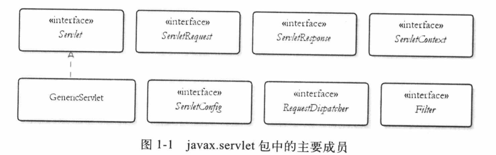
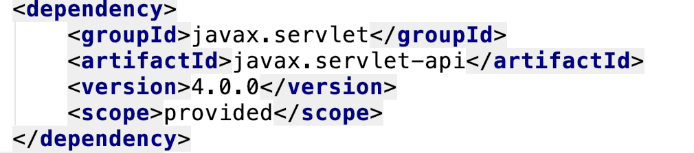
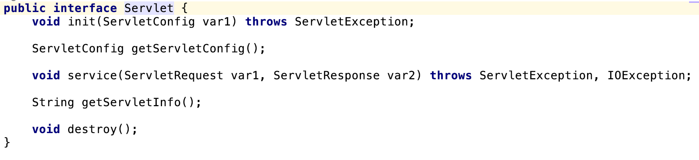
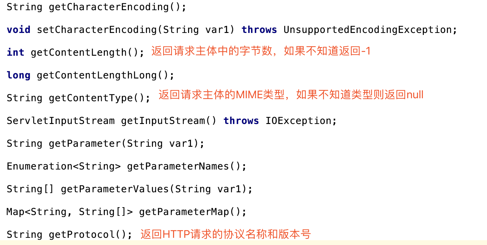
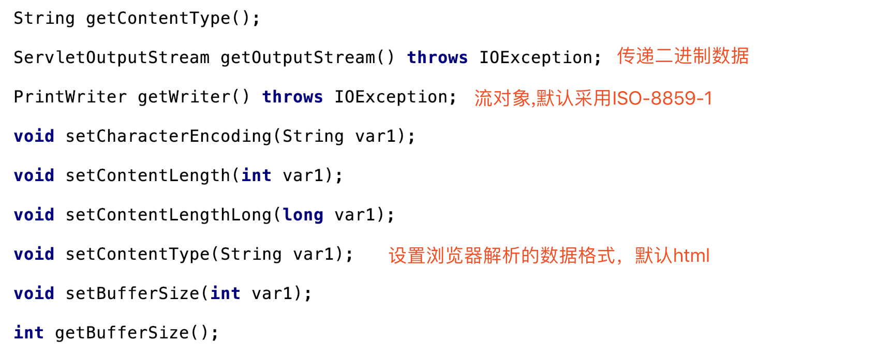
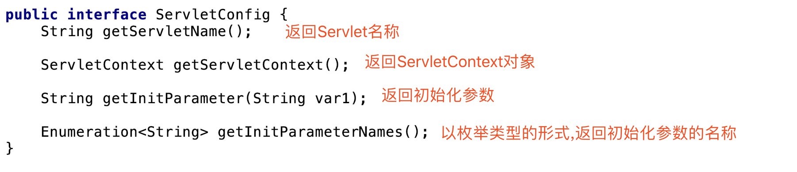
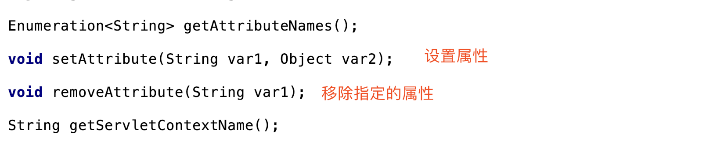
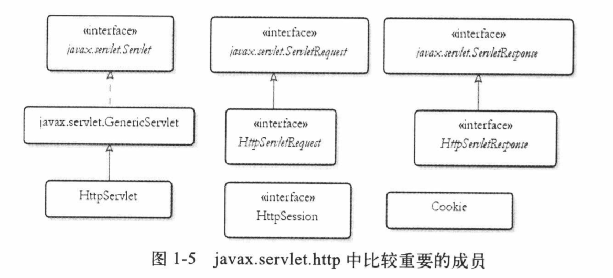
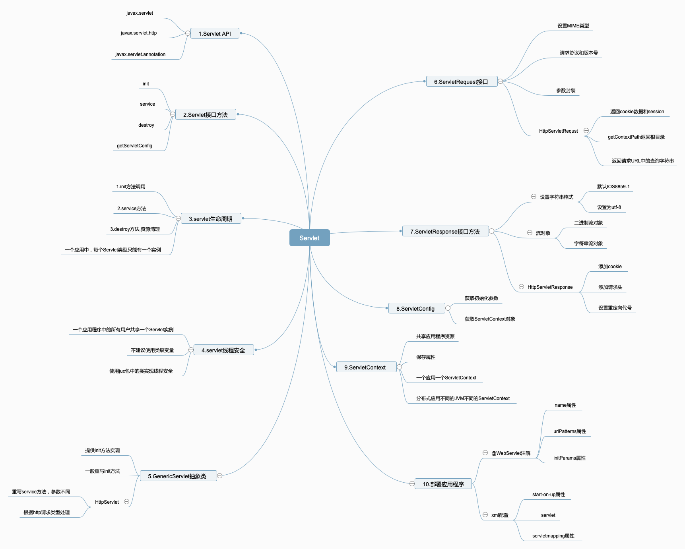

# 1.Servlet

## 1.1 Servlet API概述

Servlet API中有4个Java包,包括:

Javax.servlet:包含定义servlet与servlet容器之间契约的类和接口

Javax.servlet.http:包含定义http Servlet与servlet容器之间契约的类和接口。

javax.servlet.annotation:包含servlet、filter和Linstener进行标注的注解。它还为标注元件指定元数据。

Javax.servlet.descritpor。包含为web应用程序的配置信息提供了编程式访问的类型。

### 1.1.1 Javax.servlet包主要类型



servlet的核心是Servlet接口,这是所有的Servlet类都必须直接或者间接实现的一个接口。

Servlet容器会把Servlet类加载到内存中,并在Servlet实例中调用特定的方法。在一个应用程序中，每个servlet类型只能有一个实例。

Servlet容器还为每个应用程序创建一个ServletContext 实例。这个对象封装context(应用程序)的环境细节。每个context只有一个ServletContext。每个Servlet实例还有一个封装Servlet配置信息的ServletConfig。

## 1.2 Servlet

### 1.2.1 导入Java包

需要导入的Jar包:



### 1.2.2 Servlet方法分析

Servlet接口的方法:



用户的请求会引发Servlet 容器调用一个Servlet的service方法,并给这个方法传入一个ServletRequest实例和一个ServletRsponse实例。ServletRequest封装当前的HTTP请求,以便Servlet的开发者不必解析和操作原始的HTTP数据。ServletResponse表示当前用户的HTTP响应,它的作用是使得将响应回传给用户更容易。

## 1.3 Servlet生命周期（重点）

init、service和destroy方法属于Servlet生命周期方法。Servlet容器将根据以下原则调用这三个方法:

1.init。第一次请求Serlvet时,Servlet容器就会调用这个方法。在后续的请求中,将不再调用该方法。可以利用这个方法来编写一些应用程序初始化相关的代码。在调用这个方法时,Servlet容器会传递一个ServletConfig。一般来说，会将ServletConfig赋给一个类级变量，以便Servlet类中的其他方法也可以使用这个对象。

2.service。每次请求servlet时，Servlet容器都会调用这个方法。必须在这里编写要Servlet完成的相应代码。第一次请求Servlet时，Servlet容器会调用init方法和service方法。对于后续的请求，则只会调用service方法。

3.destroy。要销毁Servlet时，Servlet容器就会调用这个方法。它通常发生在卸载应用程序，或者关系Servlet容器的时候。一般来说，可以在这个方法中编写一些资源清理相关的代码。

### 1.3.1Servlet非生命周期方法

getServletInfo。这个方法返回Servlet的描述。可以返回可能有用的任意字符串，甚至是null。

getServletConfig。这个方法返回由Servlet容器传给init方法的ServletConfig。但是，为了让getServletConfig返回非null值，你肯定已经为传给init方法的ServletConfig赋给一个类级变量

### 1.3.2 Servlet的线程安全性问题（重点）

一个应用程序中的所有用户将会共用一个Servlet实例，因此不建议使用类级变量,除非它们是只读的,或者是java.util.concurrent.aotmic包中的成员。

## 1.4 编写基础的Servlet应用程序

### 1.4.1 编写和编译Servlet类

```java
package cn.edu.hust;

import javax.servlet.*;
import javax.servlet.annotation.WebServlet;
import java.io.IOException;
import java.io.PrintWriter;
//这个注解声明一个Servlet,name属性用来提供servlet类的名称,urlPatterns告诉容器使用这个字符串调用Servlet
@WebServlet(name = "MyServlet",urlPatterns = {"/myServlet"})
public class MyServlet implements Servlet {
    private transient ServletConfig servletConfig;
    @Override
    public void init(ServletConfig servletConfig) throws ServletException {
        this.servletConfig=servletConfig;
    }

    @Override
    public ServletConfig getServletConfig() {
        return servletConfig;
    }

    @Override
    public void service(ServletRequest servletRequest, ServletResponse servletResponse) throws ServletException, IOException {
        String servletName=servletConfig.getServletName();
        //设置返回的数据类型
        servletResponse.setContentType("text/html");
        PrintWriter printWriter=servletResponse.getWriter();
        printWriter.write("<html><head><meta charset='utf-8'></head><body>"+servletName+" Hello World"+"</body></html>");
    }

    @Override
    public String getServletInfo() {
        return "My Servlet";
    }

    @Override
    public void destroy() {
        System.out.println("Servlet 销毁。。。。");
    }
}
```

@WebServlet注解声明一个Servlet,name属性用来提供servlet类的名称,urlPatterns告诉容器使用这个字符串调用当前的Servlet

## 1.5 ServetRequest

对于每一个HTTP请求,Servlet容器都会创建一个ServletRequest实例,并将它传给Servlet的service方法。ServletRequest封装有关请求的信息。



getParameter方法是ServletRequest中常用的方法。

## 1.6 ServletResponse

ServletResponse接口表示一个Servlet响应。在调用一个Servlet的service方法之前,Servlet容器会创建一个ServletResponse,并将它作为第二个参数传给service方法。ServletResponse隐藏了将响应发给浏览器的复杂性。



## 1.7 ServletConfig

在Servlet容器初始化Servlet时,Servlet容器将ServletConfig传给Servlet的init方法。ServletConfig 封装可以通过@WebServlet或者部署描述符传给一个Servlet的配置信息。以这种方法传递的每一条信息都称作初始参数。初始参数由两个组成部分:键和值。



具体的示例:

```java
package cn.edu.hust;

import javax.servlet.*;
import javax.servlet.annotation.WebInitParam;
import javax.servlet.annotation.WebServlet;
import java.io.IOException;
import java.io.PrintWriter;
//这个注解声明一个Servlet,name属性用来提供servlet类的名称,urlPatterns告诉容器使用这个字符串调用Servlet
@WebServlet(name = "MyServlet",urlPatterns = {"/myServlet"},initParams = {@WebInitParam(name="admin",value="root"),@WebInitParam(name="email",value ="xxx@163.com")})
public class MyServlet implements Servlet {
    private transient ServletConfig servletConfig;
    @Override
    public void init(ServletConfig servletConfig) throws ServletException {
        this.servletConfig=servletConfig;
        System.out.println("Servlet 容器初始化完成。。。。");
    }

    @Override
    public ServletConfig getServletConfig() {
        return servletConfig;
    }

    @Override
    public void service(ServletRequest servletRequest, ServletResponse servletResponse) throws ServletException, IOException {
        String servletName=servletConfig.getServletName();
        //设置返回的数据类型
        servletResponse.setContentType("text/html");
        PrintWriter printWriter=servletResponse.getWriter();
        String adminName=servletConfig.getInitParameter("admin");
        printWriter.write("<html><head><meta charset='utf-8'></head><body>"+servletName+" Hello World"+"</body></html>");
    }

    @Override
    public String getServletInfo() {
        return "My Servlet";
    }

    @Override
    public void destroy() {
        System.out.println("Servlet 销毁。。。。");
    }
}
```

## 1.8 ServletContext

ServletContext表示Servlet应用程序。每个Web应用程序只有一个Context。在分布式环境中，一个应用程序同时部署到多个容器中，并且每台java虚拟机都有一个ServletContext对象。

有了ServletContext之后，就可以共享能通过应用程序的所有资源访问的信息，促进Web对象的动态注册。前者是通过将一个内部Map中的对象保存在ServletContext中来实现的。保存servletContext中的对象称为属性。



## 1.8 GenericServlet

GenericServlet抽象类，完成以下工作:

1.将init 方法中的Servletconfig赋给一个类级变量使它可以通过调用getServletConfig来获取。

2.为Servlet接口中的所有方法提供默认实现。

3.提供方法来包装ServletConfig中的方法。

如果我们要使用init可以使用无参数的init方法。

## 1.9 HTTP Servlet

javax.servlet.http中的主要类型:



### 1.9.1 HttpServlet

HttpServlet覆盖了GenericServlet中的service方法,签名如下:


和以往不同的是,这里参数是不一样的。Servlet 容器调用以往的service方法,HttpServlet中的方法如下写:

```java
public void service(ServletRequest req, ServletResponse res) throws ServletException, IOException {
    if (req instanceof HttpServletRequest && res instanceof HttpServletResponse) {
        HttpServletRequest request = (HttpServletRequest)req;
        HttpServletResponse response = (HttpServletResponse)res;
        this.service(request, response);
    } else {
        throw new ServletException("non-HTTP request or response");
    }
}
```

HttpServlet中新的service方法会查看发送请求的HTTP方法，调用一下某个方法(doGet、doPost、doHead)。

### 1.9.2 HttpServletRequest

HttpServletRequest增加几个方法:

```java
String getContextPath(); 返回请求context的请求URI部分
Cookie[] getCookies(); 返回Cookie对象数组
String getMethod();指定HttP标头的值
String getQueryString();返回请求URL中的查询字符串
HttpSession getSession();返回与这个请求有关的session对象。如果没找到，则创建新的session对象
HttpSession getSession(boolean var1);返回与这个请求有关的session对象。如果没找到，并且var1参数为true，则创建新的session对象
```

### 1.9.3 HttpServletResponse

HttpServletResponse定义的部分方法:

```java
void addCookie(Cookie var1);//给这个响应对象添加cookie
void addHeader(String var1, String var2);//给这个响应对象标头
void sendRedirect(String var1) throws IOException;//发送响应代号，将浏览器重定向到指定的位置
```

## 1.10 使用部署描述符

对于以上时,我们使用注解部署，这里换用xml部署如下:

```xml
<!DOCTYPE web-app PUBLIC
 "-//Sun Microsystems, Inc.//DTD Web Application 2.3//EN"
 "http://java.sun.com/dtd/web-app_2_3.dtd" >

<web-app>
  <display-name>Servlet-HelloWorld</display-name>

  <servlet>
    <servlet-name>MyServlet2</servlet-name>
    <servlet-class>cn.edu.hust.MyServlet</servlet-class>
    <!--在应用程序启动时加载Servlet，这个元素意味着Servlet的第一次调用并不比后续的调用更占用时间-->
    <load-on-startup>10</load-on-startup>
  </servlet>

  <servlet-mapping>
    <servlet-name>MyServlet2</servlet-name>
    <!--映射到url，访问这个URI可以调用-->
    <url-pattern>/myServlet2</url-pattern>
  </servlet-mapping>
</web-app>
```

使用load-on-startup意味着，在应用程序启动时加载Servlet，而不是第一次调用Servlet时加载；Servlet的第一次调用并不比后续的调用更占用时间。如果Servlet的init方法比较费时的话,这个元素就特别有帮助。

## 1.11百度脑图



