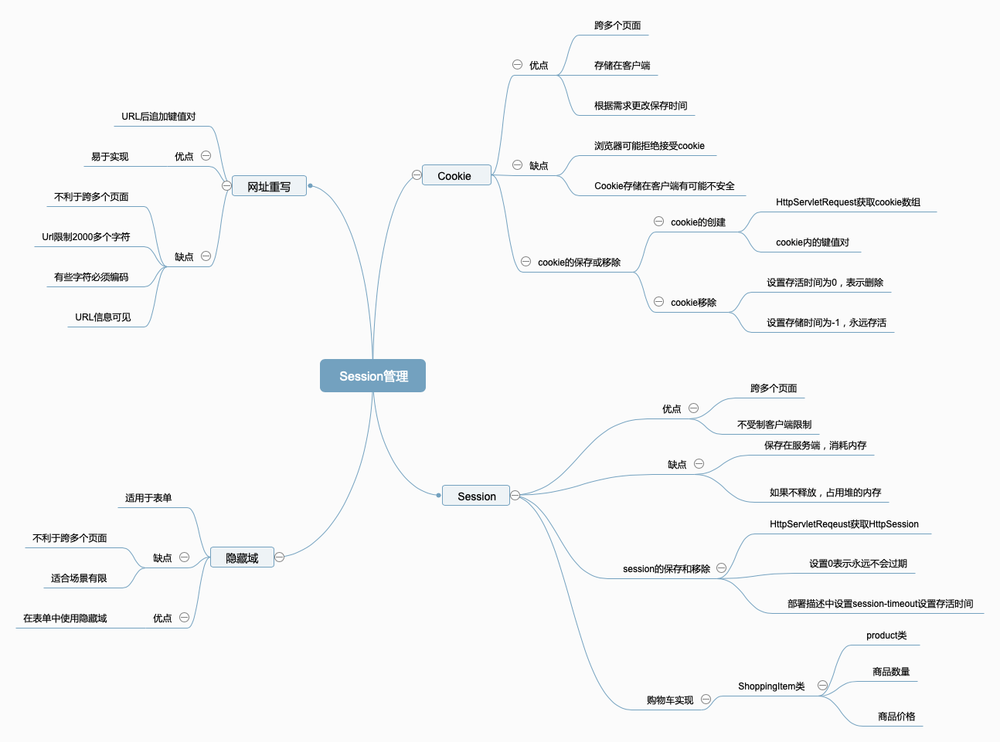

# 2.Session管理

Session管理是Web应用程序开发中一个非常重要的主体。这是因为Web语言HTTP是无状态的。本章用于保持状态的4种方法:网址重写、隐藏域、cookie以及HttpSession对象。

## 2.1网址重写

网址重写是一种Session追踪技术,需要将一个或多个token作为一个查询字符串添加到一个URL中。token的格式一般是键=值:

url?key-1=value-1&key-2=value-2...&key-n=value-n

URL和token之间要用问号隔开,两个token之间用&符号。

如果token不必在过多的URL中四处携带,那么网址重写就比较合适。采用网址重写的缺点:

1.在有些Web浏览器中,URL限制为2000个字符

2.仅当有链接要插入值时,值才能转换成后面的资源。此外,要把值添加到静态页面的链接中,可不是一件容易的事情。

3.网址重写必须在服务器端有效。所有的链接都必须带有值,这样可能出现一个问题,即一个页面中可能有很多个链接。

4.某些字符,,例如空格、&符号以及问号都必须编码

5.添加到URL中的信息是可见的。

## 2.2隐藏域

利用隐藏域来保持状态，只是将它们放在HTML表单的隐藏域中。当用户提交表单时，隐藏域中的值也传送到服务器。只有当页面包含表单，或者可以在页面中添加表单时，才适合使用隐藏域。但是像网页重写一样，也只有当要传递的信息不需要跨越多个页面时，才适合使用这种技术。

```java
package cn.edu.hust;

import cn.edu.hust.domain.Customer;

import javax.servlet.ServletException;
import javax.servlet.annotation.WebServlet;
import javax.servlet.http.HttpServlet;
import javax.servlet.http.HttpServletRequest;
import javax.servlet.http.HttpServletResponse;
import java.io.IOException;
import java.util.ArrayList;
import java.util.List;
@WebServlet(name = "customerServlet",urlPatterns = {"/showCustomer","/editCustomer","/updateCustomer"})
public class CustomerServlet extends HttpServlet {

    private List<Customer> customers=new ArrayList<Customer>();
    @Override
    protected void doGet(HttpServletRequest req, HttpServletResponse resp) throws ServletException, IOException {
        String uri=req.getRequestURI();
        if(uri.endsWith("/showCustomer"))
            showCustomer(req,resp);
        else if(uri.endsWith("/editCustomer"))
            editCustomer(req,resp);
        else
            updateCustomer(req,resp);
    }

    private void updateCustomer(HttpServletRequest req, HttpServletResponse resp) throws ServletException, IOException {
        int id=Integer.valueOf(req.getParameter("id"));
        Customer customer=customers.get(id-1);
        String name=req.getParameter("name");
        String city=req.getParameter("city");
        System.out.println("name="+name);
        System.out.println("city="+city);
        customer.setName(name);
        customer.setCity(city);
        resp.sendRedirect("/showCustomer");
    }

    private void editCustomer(HttpServletRequest req, HttpServletResponse resp) throws IOException, ServletException {
        int id=Integer.valueOf(req.getParameter("id"));
        Customer customer=customers.get(id-1);
        req.setAttribute("customer",customer);
        req.getRequestDispatcher("/views/updateCustomer.jsp").forward(req,resp);
    }

    private void showCustomer(HttpServletRequest req, HttpServletResponse resp) throws IOException, ServletException {
        req.setAttribute("customers",customers);
        System.out.println(customers);
        req.getRequestDispatcher("/views/showCustomer.jsp").forward(req,resp);
    }

    @Override
    protected void doPost(HttpServletRequest req, HttpServletResponse resp) throws ServletException, IOException {
        doGet(req,resp);
    }

    @Override
    public void init() throws ServletException {
        Customer customer1=new Customer(1,"lili","wuhan");
        Customer customer2=new Customer(2,"Mary","tianmen");
        customers.add(customer1);
        customers.add(customer2);
    }
}
```

使用隐藏域如下:

```jsp
<%--
  Created by IntelliJ IDEA.
  User: youyujie
  Date: 2018/12/6
  Time: 9:48 AM
  To change this template use File | Settings | File Templates.
--%>
<%@ page contentType="text/html;charset=UTF-8" language="java" %>
<%@taglib prefix="c" uri="http://java.sun.com/jsp/jstl/core" %>
<%@page isELIgnored="false" %>
<html>
<head>
    <title>Update Customer</title>
</head>
<body>
    <form action="/updateCustomer">
        <input type="hidden" value="${customer.id}" name="id">
        Name:<input type="text" name="name" value="${customer.name}"><br>
        City:<input type="text" name="city" value="${customer.city}"><br>
        <input type="submit" value="提交">
    </form>
</body>
</html>
```

## 2.3Cookie

隐藏域和网址重写只是适合不需要跨越许多页面的信息。cookie能解决网址重写和隐藏域都无法解决的问题。

cookie是自动地在Web服务器和浏览器之间来回传递的一小块信息。

cookie是作为HTTP标头嵌入的，因此传输它的过程由HTTP协议处理。此外，还可以根据自己的需要设置cookie的有效期限。

cookie 的不足之处是通过修改他的浏览器设置来拒绝接受cookie。

```java
Cookie cookie=new Cookie(name,value);//创建cookie
//可以设置它的domain、path以及maxAge属性
```

为了将cookie发送给浏览器，需要在HttpServletResponse上调用add方法:

```java
httpServeltResponse.addCookie(cookie);
```

如何删除Cookie呢？

​	只需要将cookie的maxAge设置为0即可。

```java
package cn.edu.hust;

import javax.servlet.ServletException;
import javax.servlet.annotation.WebServlet;
import javax.servlet.http.Cookie;
import javax.servlet.http.HttpServlet;
import javax.servlet.http.HttpServletRequest;
import javax.servlet.http.HttpServletResponse;
import java.io.IOException;
@WebServlet(name = "loginServlet",urlPatterns = {"/loginServlet"})
public class LoginServlet extends HttpServlet{
    @Override
    protected void doGet(HttpServletRequest req, HttpServletResponse resp) throws ServletException, IOException {
        Cookie[] cookies=req.getCookies();
        if(cookies!=null)
            for(Cookie cookie:cookies)
                if("username".equals(cookie.getName()))
                {
                    req.getRequestDispatcher("/success.jsp").forward(req,resp);
                    return;
                }
        req.getRequestDispatcher("/login.jsp").forward(req,resp);
    }

    @Override
    protected void doPost(HttpServletRequest req, HttpServletResponse resp) throws ServletException, IOException {
       String name=req.getParameter("name");
       String passwd=req.getParameter("value");
       Cookie cookie=new Cookie("username",name);
       cookie.setMaxAge(30);
       resp.addCookie(cookie);
        req.getRequestDispatcher("/success.jsp").forward(req,resp);
    }

}
```

## 2.4 HttpSession对象

用户可以没有或者一个HttpSession,并且只能访问他/她自己的HttpSesison。

HttpSession是当一个用户第一次访问某个网站时自动创建的。通过在HttpSessionRequest中调用getSession方法,可以获取用户的HttpSession。getSession有两个重载方法 :

```java
HttpSession getSession()
HttpSession getSession(boolean create)
```

HttpSession的setAttribute方法将一个放在HttpSession中，其方法签名如下;

```java
void setAttribute(String name,Obejct value)
```

 与网址重写、隐藏域和cookie不同的地方在于，放在HttpSession中的值时保存在内存中的。因此，只能将将可能小的对象放在里面，并且数量不能太多。

添加到HttpSession中的值不一定是String,可以为任意Java对象，只要它的类实现了java.io.Serializable接口即可，以便当Servlet容器认为有必须的时候，保存的对象可以序列化成一个文件或者保存到数据库中。

HttpSession获取属性是通过调用getAttribute方法，同时传递一个属性名称，可以获取HttpSession中保存的对象。这个方法的签名如下:

```java
java.lang.Object getAttribute(java.lang.String name)
```

 可以使用getAttributeNames返回一个Enumeration,迭代一个HttpSession中的所有属性:

```java
java.util.Enumertion<java.lang.String> getAttributeNames();
```

### 2.4.1Session的存储

​	HttpSession中保存的值不发送到客户端，这与其他的Session管理方法不同。而是servlet容器为它所创建的每一个HttpSession生成一个唯一的标识符，并将这个标识符作为一个token发送给浏览器，一般是作为一个名为JSESSIONID的cookie，或者作为一个jsessionid参数添加到URL后面。在后续的请求中，浏览器会将这个token发送回服务器，使服务器能够知道是那个用户发出请求。

​	通过在HttpSession中调用getId方法HttpSession的标志符。

```java
java.lang.String getId()
```

HttpSession还定义了一个invalidate方法。这个方法强制Session过期，并将绑定到它的所有对象都解除绑定。在默认情况下，HttpSession是在用户静默一定时间之后过期。可以在部署描述符的session-timeout元素中将session的期限设置为整个应用程序。

​	很多时候，还需要销毁未过期却又没有的HttpSession实例，以便释放一些内存空间。

​	可以调用getMaxInactiveinterval方法，以了解一个HttpSession在用户最后一次访问以后可以维持多久。这个方法返回用户离开秒数。setMaxInactiveinterval方法可以帮助你为个别HttpSession的Session期限设置一个不同的值。

```java
void setMaxInactiveInterval(int seconds)
```

​	这个方法传递0，表示Session永远不会过期。但是这不是一个好办法，因为HttpSession占用的堆空间将永远不会释放，直到应用程序卸载或Servlet容器关闭为止。

这里我们用购物车实现为例:

```java
package cn.edu.hust.cn.edu.hust.controller;

import cn.edu.hust.domain.Product;
import cn.edu.hust.domain.ShoppingItem;

import javax.servlet.ServletException;
import javax.servlet.annotation.WebServlet;
import javax.servlet.http.HttpServlet;
import javax.servlet.http.HttpServletRequest;
import javax.servlet.http.HttpServletResponse;
import javax.servlet.http.HttpSession;
import java.io.IOException;
import java.util.*;

@WebServlet(name = "shoppingCartServlet",urlPatterns = {"/showProducts","/addProducts","/showCart"})
public class ShoppingCartServlet extends HttpServlet {
    private List<Product> products=new ArrayList<Product>();
    private final String SHOPPING_CART="ShoppingCart";
    @Override
    protected void doGet(HttpServletRequest req, HttpServletResponse resp) throws ServletException, IOException {
        String uri=req.getRequestURI();
        if(uri.endsWith("/showProducts"))
            showProducts(req,resp);
        else if(uri.endsWith("/addProducts"))
            addProducts(req,resp);
        else if(uri.endsWith("/showCart"))
            showCart(req,resp);
            
    }

    private void showCart(HttpServletRequest req, HttpServletResponse resp) throws ServletException, IOException {
        HttpSession session=req.getSession();
        HashMap<Integer,ShoppingItem> itemHashMap= (HashMap<Integer, ShoppingItem>) session.getAttribute(SHOPPING_CART);
        if(itemHashMap==null)
            itemHashMap=new HashMap<Integer,ShoppingItem>();
        Collection<ShoppingItem> shoppingItems= itemHashMap.values();
        req.setAttribute("shoppingItems",shoppingItems);
        req.getRequestDispatcher("/cartDetail.jsp").forward(req,resp);
    }

    private void addProducts(HttpServletRequest req, HttpServletResponse resp) throws ServletException, IOException {
        HttpSession session=req.getSession();
        int id=Integer.valueOf(req.getParameter("id"));
        //从session中取出购物车
        HashMap<Integer,ShoppingItem> cart=(HashMap<Integer, ShoppingItem>) session.getAttribute(SHOPPING_CART);
        if(cart==null)
            cart=new HashMap<>();
        if(cart.get(id)==null){
            Product product=products.get(id-1);
            cart.put(id,new ShoppingItem(product,1));
        }
        else
        {
            ShoppingItem shoppingItem=cart.get(id);
            shoppingItem.setQuantity(shoppingItem.getQuantity()+1);
            cart.put(id,shoppingItem);
        }
        //将购物车放入到session中去
        session.setAttribute(SHOPPING_CART,cart);
        session.setMaxInactiveInterval(30*60);
        req.getRequestDispatcher("/success.jsp").forward(req,resp);
    }

    private void showProducts(HttpServletRequest req, HttpServletResponse resp) throws ServletException, IOException {
        req.setAttribute("products",products);
        req.getRequestDispatcher("/productList.jsp").forward(req,resp);
    }

    @Override
    protected void doPost(HttpServletRequest req, HttpServletResponse resp) throws ServletException, IOException {
        doGet(req,resp);
    }

    @Override
    public void init() throws ServletException {
        products.add(new Product(1,"iphoneX","iphone首款全面屏手机",5988));
        products.add(new Product(2,"iMac","苹果公司的台式电脑",58999));
        products.add(new Product(3,"MacBookPro","苹果公司的高端系列笔记本",12888));
        products.add(new Product(4,"联想小新系列","联想公司适合青年的笔记本电脑",5899));
        products.add(new Product(5,"小米Mix3","小米公司出品的高端手机",3499));
        products.add(new Product(6,"魅族16","魅族公司的高端系列手机",2899));
    }
}
```

这里主要是购物车的实现,我们使用了一个ShoppingItem来进行记录商品的数量，这是一个简易的购物车。

## 2.5 百度脑图

