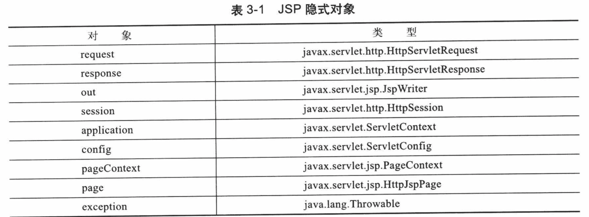
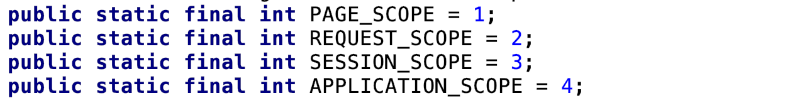
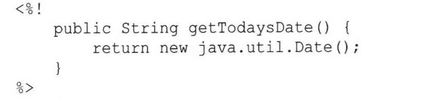
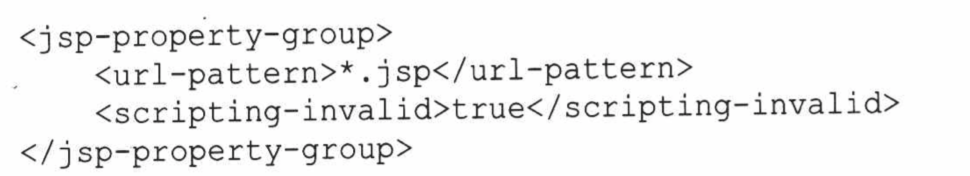
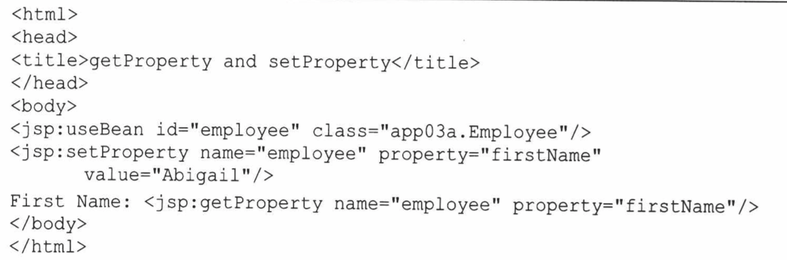
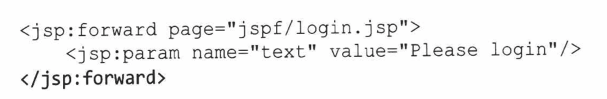
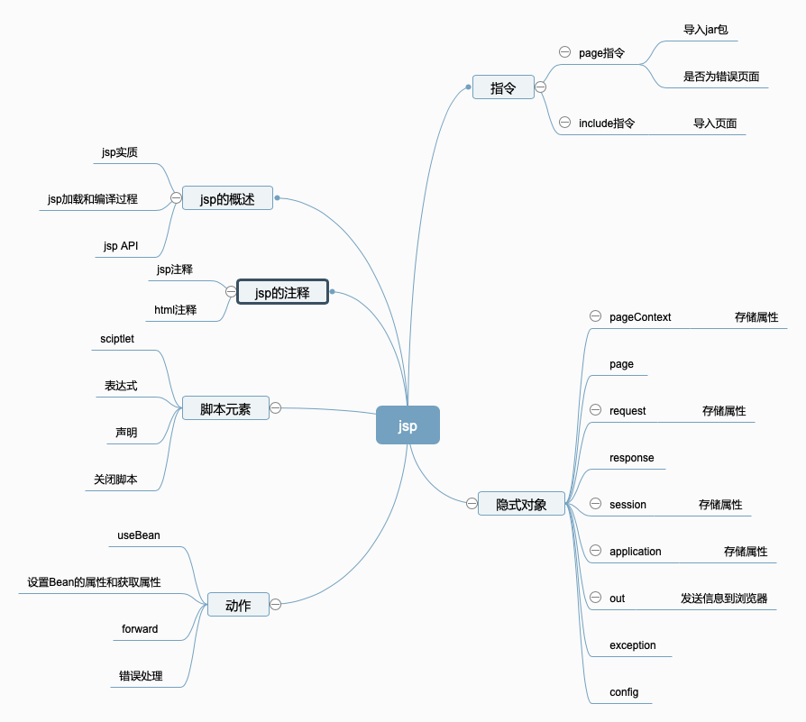

# 3.JSP

本章主要讨论JSP页面中的注释、隐式对象,以及三个语句元素，分别是指令、脚本元素以及动作。

## 3.1JSP概述

### 3.1.1JSP概念和实质

​	JSP页面其实是一个servlet。

​	JSP页面是在JSP容器中运行的。Servlet容器一般也是JSP容器。

### 3.1.2 JSP和JSP容器

​	第一次请求一个JSP页面时,Servlet/JSP容器要做两件事情:

1.将JSP页面转换成一个JSP页面实现类，这是一个实现javax.servlet.jsp.JspPage接口或其子接口Javax.servlet.jsp.HttpJspPage的Java类。JspPage是javax.servlet.Servlet的子接口,这样会使每个JSP页面都称为一个Servlet。

2.如果转换成功,Servlet/JSP容器将会编译Servlet类。之后,容器加载和实例化Java字节码,并执行它通常对Servlet所做的生命周期操作。对于同一JSP页面的后续请求,Servlet/JSP容器会查询看这个JSP页面自从最后一次转换以来时候修改过。如果修改过，就会重新转换、重新编译，并执行。如果没有，则执行内存中已经存在的JSP Servlet。

### 3.1.2 JSP API

JSP中有一个API，其中包含4个包:

1、javax.servlet.jsp。包含核心类和接口，JspPage和HttpJspPage接口是这个包中的重要成员。所有JSP页面实现类都必须实现JspPage或HttpJspPage。

2.javax.servlet.jsp.targext.包含用于开发定制标签的类型。

3.javax.el.为EL表达式提供API。

4.javax.servletjsp.el.提供Servlet/JSP容器必须支持的类,以便支持JSP中的EL

JSP页面与Servlet不同的另一个方面是,前者不需要在部署描述符中进行标注,或映射成一个URL。应用程序目录下的每一个jsp页面都可以通过在浏览器中输入页面的路径来实现直接调用。

### 3.1.3 todayDate.jsp

```jsp
<%--
  Created by IntelliJ IDEA.
  User: youyujie
  Date: 2018/12/7
  Time: 10:23 AM
  To change this template use File | Settings | File Templates.
--%>
<%@ page contentType="text/html;charset=UTF-8" language="java" %>
<%@page import="java.util.Date"%>
<%@page import="java.text.DateFormat" %>
<html>
<head>
    <title>今天的时间</title>
</head>
<body>
    <%
        DateFormat  dateFormat=DateFormat.getDateInstance(DateFormat.LONG);
        String s=dateFormat.format(new Date());
        System.out.println(s);
        out.println(s);
    %>
</body>
</html>
```

第一，Java代码要用<%%>包起来,并且可以放在JSP页面中的任何位置;第二,为了导入一个JSP页面中要用的Java类型,可以利用page指令中import属性 。如果没有导入那么在代码中必须编写Java类型的全类名。

## 3.2 备注

JSP页面可以使用两种备注:
1.JSP备注.注明该页面的作用

2.HTML/XHTML备注。这些将会被发送给浏览器。

```jsp
<%----%>
<!---->
```

## 3.3 隐式对象

Servlet容器将几个对象传给它所运行的Servlet。

在JSP中，可以通过使用隐式对象来获取哪些对象。JSP的隐式对象如下:



pageContext是指为页面创建的javax.servlet.jsp.PageContext。它提供了有用的context信息，并通过一些名如其义的方法来访问与Servlet有关的各种对象。

PageContext提供了另一些重要的方法是哪些存取属性，如getAttribute和setAttribute方法。

属性可以保存在以下4种范围中:page、request、session以及applicaiton。page范围最窄,保存子这里的属性只能在同一JSP页面中使用。request范围是指当前的ServletRequest,session范围是指当前的HttpSession，application范围是指ServletContext。



保存一个属性如下:

```jsp
<%
    //使用这条语句类似于在request域保存属性
    pageContext.setAttribute("name","zhangsan",PageContext.REQUEST_SCOPE);
%>
```

隐式对象out引用java.servlet.jsp.JspWriter,它类似于在HttpServletResponse中调用getWrtier()之后得到java.io.Printer.可以调用他的print方法重载PrintWriter,将信息发送到浏览器。

隐式对象page表示当前jsp页面，一般不为JSP页面的设计者所用。

## 3.4 指令

​	指令是第一种JSP句法元素，其指示JSP转换器应该如何将某个JSP页面转换成Servlet的命令。

### 3.4.1 page指令

​	利用page指令可以就当前jsp页面的某些方面对JSP转换器提出指示。

page指令的语法如下:​	

```jsp
<%@page attribute="value1" attribute2="value2"%>
```

下面是page指令的属性列表:

​	1.import.指定要导入的一种或多种java类型。

​	2.session。值为true,表示这个页面参与Session管理;值为false时,表示不参与session挂你了。

​	3.buffer。指定隐式对象out的缓冲区大小，以kb为单位

​	4.autoFlush。默认值为true，表示当缓冲区满时，被缓存的输出应该自动刷新。只为false时，表示只有在调出隐式对象response的flush方法时，才进行刷新缓冲区。

​	5.isThreadSafe。表示页面中实现的线程安全级别。建议不要使用

​	6.info。指定所生成Servlet的getServletInfo方法返回值。

​	7.errorPage。表示这个页面是否负责处理错误。	

​	8.isErrorPage。表明这个页面是否负责处理错误

​	9.contentType。指定页面隐式对象response的内容类型，默认为text/html

​	10.pageEncoding。指定页面的字符编码，默认值为ISO-8859-1

​	11.isELIgnored。表明是否忽略EL表达式

​	12.language。指定该页面使用的脚本语言，默认值为java。

​	13.extends。指定这个jsp页面的实现必须扩展的超类。

### 3.4.2 include指令

​	利用include指令可以将另一个文件的内容放到当前的JSP页面中。在一个JSP页面中可以使用多个include指令。include指令的语法如下;

​	<%@ include file="url"%>

​	JSP转换器转换include指令时，用include文件的内容替换指令。

```jsp
<hr/>
    &copy;2012 BrainySoftware
<hr/>
//另一个页面
<%--
  Created by IntelliJ IDEA.
  User: youyujie
  Date: 2018/12/7
  Time: 11:14 AM
  To change this template use File | Settings | File Templates.
--%>
<%@ page contentType="text/html;charset=UTF-8" language="java" %>
<html>
<head>
    <title>Including a file</title>
</head>
<body>
    This is the included content:<hr/>
    <%@ include file="copyright.jspf"%>
</body>
</html>

```

按照规范,include文件的扩展名应为jspf,表示jsp fragment。

## 3.5 脚本元素

第二种jsp句法元素是脚本元素，他将java代码合并成一个jsp页面。脚本元素有3种类型:Scriptlet、声明及表达式

### 3.5.1 Scriptlet

```jsp
<%--
  Created by IntelliJ IDEA.
  User: youyujie
  Date: 2018/12/7
  Time: 10:23 AM
  To change this template use File | Settings | File Templates.
--%>
<%@ page contentType="text/html;charset=UTF-8" language="java" %>
<%@page import="java.util.Date"%>
<%@page import="java.text.DateFormat" %>
<html>
<head>
    <title>今天的时间</title>
</head>
<body>
    <%
        DateFormat  dateFormat=DateFormat.getDateInstance(DateFormat.LONG);
        String s=dateFormat.format(new Date());
        System.out.println(s);
        out.println(s);
    %>
    <%
    	//上面的片段可以被下面访问
    	out.println(s);
    %>
</body>
</html>
```

### 3.5.2 表达式

​	表达式的运算结果会被填入隐式对象out的print方法中。例如

```java
Today is <%=java.utilCalendar.getInstance().getTime()%>
```

### 3.5.3 声明

可以声明能够在jsp页面中使用的变量和方法。声明要用<%!和%>包起来。



### 3.5.4 关闭脚本元素

​	可以通过部署描述符来进行关闭jsp脚本元素



## 3.6 动作

第三种句法元素是动作,它们被编译成指定某个操作的java代码，例如访问某个java对象，或者调用某个方法。

### 3.6.1 useBean

​	这个动作将创建一个与某个Java对象相关的脚本变量。它是将表现逻辑与业务逻辑恩哥开来的最容易的方法之一。

```java
<%--
  Created by IntelliJ IDEA.
  User: youyujie
  Date: 2018/12/7
  Time: 11:48 AM
  To change this template use File | Settings | File Templates.
--%>
<%@ page contentType="text/html;charset=UTF-8" language="java" %>
<html>
<head>
    <title>useBean</title>
</head>
<body>
<jsp:useBean id="today" class="java.util.Date"/>
<%=today%>
</body>
</html>
```

### 3.6.2 setProperty和getProperty



setProperty动作是在一个Java对象种保存一个属性，getProperty则是获取一个Java对象的属性。

### 3.6.4 forward

 	forward动作是将当前页面跳转到另一个不同的资源。



### 3.6.5 错误处理

​	一般都是将错误引向属性值指定的错误处理页面。

​	利用page指令的isErrorPage属性,就可以把一个JSP页面变成一个错误处理页面。

```jsp
<%--
  Created by IntelliJ IDEA.
  User: youyujie
  Date: 2018/12/7
  Time: 4:38 PM
  To change this template use File | Settings | File Templates.
--%>
<%@ page contentType="text/html;charset=UTF-8" language="java" %>
<%@ page isErrorPage="true"%>
<html>
<head>
    <title>Error</title>
</head>
<body>
    Error message:
    <%
        out.print(exception.toString());
    %>
</body>
</html>
```

## 3.7 思维导图

