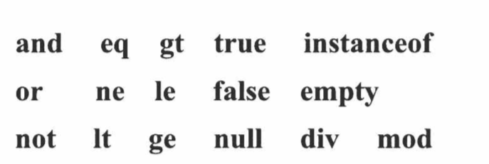
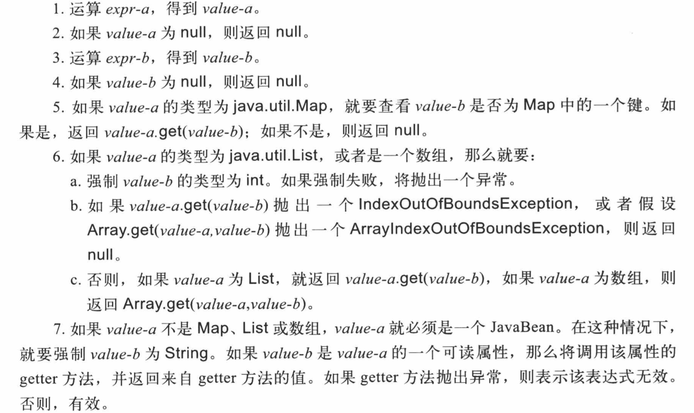
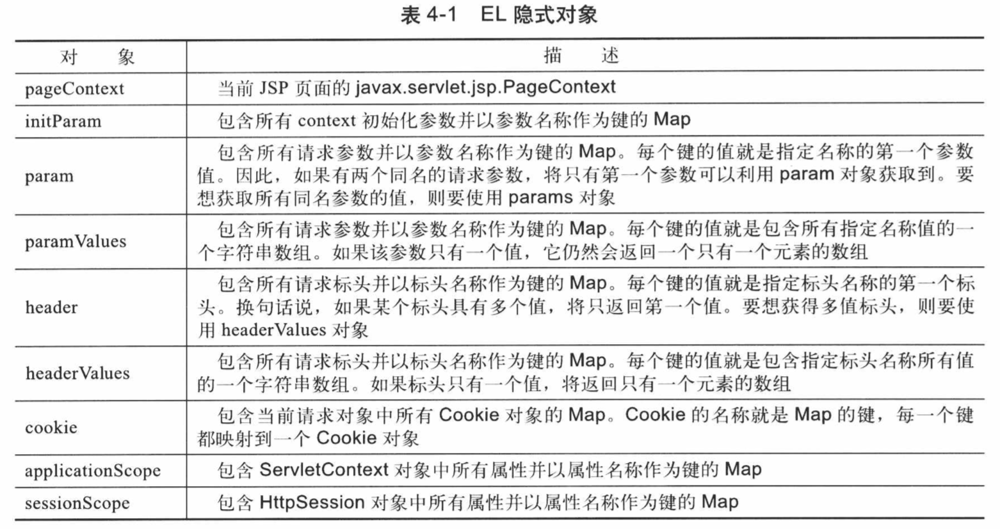
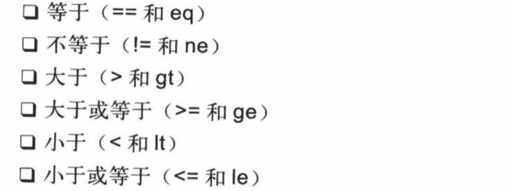
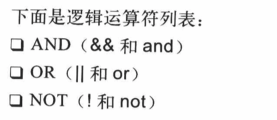
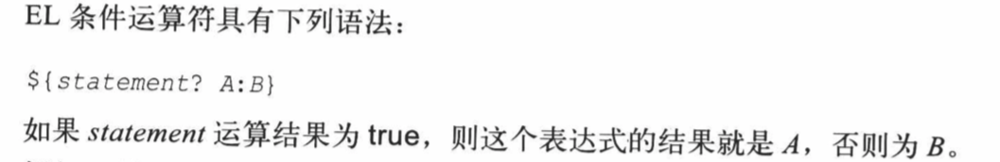
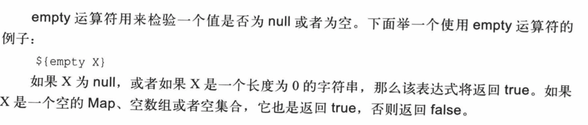

# 4.EL表达式

## 4.1 EL语法

EL表达式式以${}结束，一个EL表示式的构造如下:

${expression}

```
//这里有一些示例
${x+y}//计算x+y
//两个表达式相连接，这种也很常见,所以表达式的运算顺序是从左到右，结果的类型强制为String
${a+b}${c+d}
```

### 4.1.1 保留字

下面是一些保留字,不能作为标识符:



### 4.1.2 []和.运算符

EL表达式可以返回任何类型。

如果某个EL表达式的结果对象中有一个属性，可以使用[]或.运算符来访问该属性。形式如下

```
${object["propertyName"]}
${object.propertyName}
```

  如果一个对象的属性碰巧返回另一个带有属性的对象,那么就可以利用[]或者.来访问第二个对象的属性。

例如以下:

```jsp
${pageContext["request"]["servletPath"]}
${pageContext.request["serletPath"]}
${pageContext.request.servletPath}
${pageContext["request"].servletPath}
```

### 4.1.3 运算规则

EL表达式的运算顺序是从左到右。对于expr-a[expr-b]这种表达式,其EL表达式的运算规则如下:



## 4.2 访问JavaBean

我们可以使用[]或者.来访问JavaBean的属性:

```
${beanName["propertyName"]}
```

## 4.3 EL隐式对象

EL通过提供了一组它自己的隐式对象，可以帮你访问对象。



### 4.3.1 pageContext

​	pageContext对象表示当前JSP页面的javax.servlet.jsp.PageContext,它包含九大隐式域对象。

​	可以利用以下任意一个表达式获得当前的ServletRequest:

```
${pageContext.request}
${pageContext["request"]}
```

### 4.3.2 initParam

​	隐式对象initParam用于获取一个context参数值。例如,要想获得context参数password,需使用下面的表达式:

```
${initParam.password}
```

### 4.3.3 param

​       隐式对象param用于获取一个请求参数。这个对象表示一个包含所有请求参数的Map。例如,为了获取参数userName,需使用下面的表达式:

```
${param.userName}
```

### 4.3.4 paramValues

​	利用隐式对象paramValues可以获取一个请求参数的多个值。这个对象表示一个包含所有请求参数并以参数名称作为键的Map。每个键的值都是一个字符串数组，其中包含指定参数名称的所有值。

​	例如如果获取selectedOptions参数的第一个和第二个值,可以使用如下表达式;

```
${paramValues.selectedOptions[0]}
${paramValues.selectedOptions[1]}
```

### 4.3.5 header

​	隐式对象header表示一个包含所有请求头的Map。要获取一个标头值,需要该标头名称作为键。

例如获取accept-language标头的值:

```
${header["accept-language"]}
```

### 4.3.6 headerValues

​	隐式对象headerValues表示一个包含所有请求标头并以标头名称作为键的Map。但与header不同的是，隐式对象headerValues返回Map返回一个字符串数组。例如:

```
${headerValues["accept-language"][0]}
```

### 4.3.7cookie

​	利用隐式对象cookie可以获取一个cookie。这个对象表示包含当前HttpServletReqeust中所有cookie的Map。

### 4.3.8 applicationScope、sessionScope、requestScope及pageScope

​	利用隐式对象applicationScope获得一个application范围的变量。

​	注意，在Servlet/JSP编程中，有作用范围的对象是指放在以下这些对象中作为属性的对象:PageContext、ServletRequest、HttpSession或者ServletContext。隐式对象sessionScope、requestScope及pageScope与applicationScope相似。但是其范围分别是session、request及page。

​	有作用范围的对象也可以用一个没有指定范围的EL表达式进行访问。在这种情况下，JSP容器将返回在PageContext、ServletRequest、HttpSession或者ServletContext中第一次识别到的指定对象。搜索顺序最小范围开始，到最大范围。

## 4.4使用其他EL运算符

EL提供了其他的运算符:算术运算符、关系运算符、逻辑运算符、条件运算符及empty运算符。

### 4.4.1 算术运算符

运算符有5个:

1.+

2.-

3.*

4./

5.%

### 4.4.2 关系运算符



### 4.4.3 逻辑运算符



### 4.4.4 条件运算符



### 4.4.5 empty运算符



## 4.5 使用EL表达式

```java
package cn.edu.hust;

import cn.edu.hust.domain.Address;
import cn.edu.hust.domain.Customer;

import javax.servlet.ServletException;
import javax.servlet.annotation.WebServlet;
import javax.servlet.http.HttpServlet;
import javax.servlet.http.HttpServletRequest;
import javax.servlet.http.HttpServletResponse;
import java.io.IOException;
@WebServlet(name = "elServlet",urlPatterns = {"/elServlet"})
public class ELServlet extends HttpServlet{

    @Override
    protected void doGet(HttpServletRequest req, HttpServletResponse resp) throws ServletException, IOException {
        //1.首先设置地址
        Address address=new Address(1,"中国","湖北","武汉",431700);
        Customer customer=new Customer(1,"Mary",address);

        req.setAttribute("customer",customer);
        req.getRequestDispatcher("/customer.jsp").forward(req,resp);
    }

    @Override
    protected void doPut(HttpServletRequest req, HttpServletResponse resp) throws ServletException, IOException {
       doGet(req,resp);
    }
}
```

```jsp
<%--
  Created by IntelliJ IDEA.
  User: youyujie
  Date: 2018/12/8
  Time: 1:31 PM
  To change this template use File | Settings | File Templates.
--%>
<%@ page contentType="text/html;charset=UTF-8" language="java" %>
<%@ page isELIgnored="false" %>
<html>
<head>
    <title>Customer Detail</title>
</head>
<body>
    <h1>Accpet-Language:${header["accept-language"]}</h1><br>
    <h1>Customer Name:${requestScope.customer.name}</h1><br>
    <h1>${customer.address.city}</h1><br>
    <h1>${pageContext.session.id}</h1><br>
    <h1>sessionId:${pageContext.session.id}</h1>
</body>
</html>
```

## 4.6 思维导图


