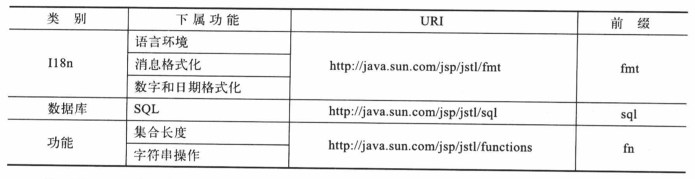
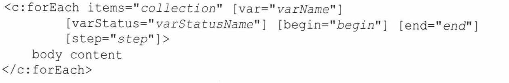
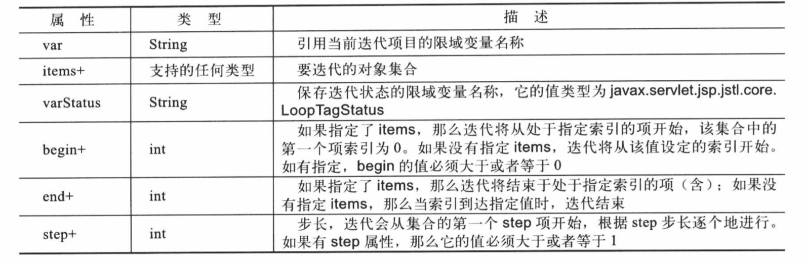

# 5.JSTL

## 5.1 JSTL类库

JSTL是指标准标签类库，但它是通过多个标签类理由来显露其动作指令的。




## 5.2 通用动作指令

用来操作限域变量的3个通用动作指令:out、set和remove。

### 5.2.1out标签

​	out标签对表达式进行运算，并将结果输出到当前的JspWriter。out的语法有两种形式,即有主体内容和没有主体内容:

​	

​	out的主体内容是jsp。该标签的属性列表如下:


out中的default属性可以设置为一个默认值，当赋予其value属性的EL表达式返回null时，就会显示默认值。

default属性可被赋予动态值。

### 5.2.2 set标签

利用set标签可以完成以下工作:

​	1.创建一个字符串和引用该字符串的一个限域变量。

​	2.创建一个限域变量，并引用已经存在的某一个限域变量。

​	3.设置限域对象的属性。

如果利用set创建限域变量,那么处于该标签之后的整个jsp页面将会可以使用该变量。

set标签的语法有四种形式。

第一种形式用来创建一个限域变量，在该变量的value属性中可以指定要创建的字符串，或者现有的限域对象。


第二种形式与第一种相似，只不过要创建的字符串或者要引用的限域对象是作为主体内容传递的:


允许在主体内容中有jsp代码。

第三种形式是设置限域对对象的属性值。target属性指定限域对象，property属性指定限域对象的属性。


第四种形式:


set标签的属性;


### 5.2.3 remove 标签

利用remove标签删除限域变量:


限域变量引用的对象并没有删除。因此，如果另一个限域对象也在引用这个对象，那么仍然可以通过另外这个限域对象来访问该对象。


## 5.3 条件式动作指令

jstl中有4个标签可以执行条件动作指令:if、choose、when和otherwise。

### 5.3.1 if标签

​	if标签先对某个条件进行测试，如果该条件运算结果为true,则处理它的主体内容。

if的语法有两种形式,第一种形式没有主体内容:


第二种形式有主体内容;


if标签的属性如下:


为了模拟else的场景，需要使用两个if标签，并用两个相反的条件。

### 5.3.2 choose、when和otherwise标签

​	choose和when标签的作用与Java中的switch和case关键字相似，也就是说，它们为互相排斥的条件式执行提供相关内容。choose标签内部必须嵌有一个或多个when标签，每个when标签代表可以进行运算和处理的一种情况。otherwise标签用于默认的条件代码块，如果所有when标签的测试条件运算结果都不为true，就会执行该代码块。如果有otherwise标签，它必须放在最后一个when标签之后。


## 5.4 iterator动作指令

​	当需要迭代多次，或者需要迭代一个对象集合时，iterator动作指令就非常好用。jstl提供了两个可以执行iterator动作指令的标签:forEach和forTokens。

### 5.4.1 forEach 标签

​	forEach是将一个主体内容迭代多次，或者迭代一个对象集合。可以迭代的对象包括所有的java.util.Collection和java.util.Map接口的实现，以及对象或者基本类型的数组。

​	forEach的语法有两种形式。第一种是将body内容重复一定的次数:


​	第二种形式用于迭代一个对象集合:



foreach标签的属性如下:



```java
package cn.edu.hust;

import cn.edu.hust.domain.Book;

import javax.servlet.ServletException;
import javax.servlet.annotation.WebServlet;
import javax.servlet.http.HttpServlet;
import javax.servlet.http.HttpServletRequest;
import javax.servlet.http.HttpServletResponse;
import java.io.IOException;
import java.util.ArrayList;
import java.util.List;
@WebServlet(name = "bookServlet",urlPatterns = {"/showBooks","/login",})
public class BookServlet extends HttpServlet{
    private List<Book> books=new ArrayList<Book>();
    @Override
    protected void doGet(HttpServletRequest req, HttpServletResponse resp) throws ServletException, IOException {
        String uri=req.getRequestURI();
        if(uri.endsWith("/login"))
        {
            req.setAttribute("name","liming");
            req.getRequestDispatcher("/index.jsp").forward(req,resp);
        }
        else if(uri.endsWith("/showBooks"))
        {
            req.setAttribute("books",books);
            req.getRequestDispatcher("/bookList.jsp").forward(req,resp);
        }
    }

    @Override
    protected void doPost(HttpServletRequest req, HttpServletResponse resp) throws ServletException, IOException {
        doGet(req,resp);
    }

    @Override
    public void init() throws ServletException {
        Book book1=new Book("1","Netty in Action","Netty初级入门书籍",56.89f);
        Book book2=new Book("2","Netty 进阶之路","Netty进阶的书籍",86.89f);
        Book book3=new Book("3","Spring in Action","Spring学习书籍",126.54f);
        Book book4=new Book("4","SpringBoot in Action","SpringBoot学习书籍",78f);
        Book book5=new Book("5","SpringCloud学习之路","SpringCloud学习书籍",76.23f);
        books.add(book1);
        books.add(book2);
        books.add(book3);
        books.add(book4);
        books.add(book5);
    }
}
```

下面是jsp页面:

```jsp
<%--
  Created by IntelliJ IDEA.
  User: youyujie
  Date: 2018/12/10
  Time: 5:36 PM
  To change this template use File | Settings | File Templates.
--%>
<%@ page contentType="text/html;charset=UTF-8" language="java" %>
<%@ taglib prefix="c" uri="http://java.sun.com/jsp/jstl/core" %>
<%@page isELIgnored="false" %>
<html>
<head>
    <title>所有的书籍</title>
</head>
<body>
    <table border="1" cellpadding="0" cellspacing="0">
        <thead>
            <tr>
                <th>序号</th>
                <th>ISBN码</th>
                <th>书籍名称</th>
                <th>书籍描述</th>
                <th>书籍价格</th>
            </tr>
        </thead>
        <tbody>
            <c:forEach items="${requestScope.books}" var="book" varStatus="status">
                <tr >
                    <td>${status.count}</td>
                    <td>${book.ISBN}</td>
                    <td>${book.title}</td>
                    <td>${book.description}</td>
                    <td>${book.price}</td>
                </tr>
            </c:forEach>
        </tbody>
    </table>
</body>
</html>
```

### 5.4.2 forTokens标签

​	forToken标签可用于迭代以特定分界符分隔的token，这个动作指令的语法如下:


主体内容为jsp；下面是该标签属性 ：


## 5.5 思维导图

