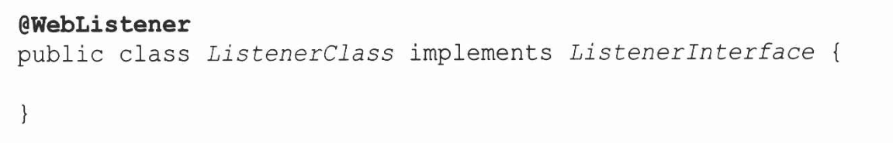
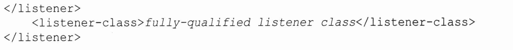
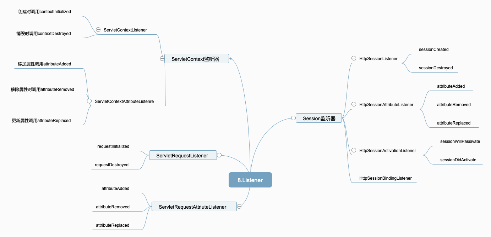

# 8.监听器

所有事件类均源自java.uitl.Event并且监听器字一下三个不同级别中均可用：ServletContext、HttpSession以及ServletRequest

## 8.1 监听器接口和注册

​	创建监听器的监听接口术语javax.servlet和javax.servlet.http包的一部分

​	1.javax.servlet.ServletContextListener，对ServletContxt生周期做出响应的监听器。

​	2.javax.servlet.ServletContextAttributeListener.添加、删除或替换某个ServletContext属性时采用该监听器

​	3.javax.servlet.http.HttpSessionAttributeListener.创建、移除或替换Servlet上下文属性时响应的监听器

​       注册监听器的方法：



​     在xml配置文件中注册



## 8.2 ServletContext 监听器

### 8.2.1 ServletContextListener

​	 ServletContextListener会对ServletContext的初始化和解构做出反应。

```java
package cn.edu.hust.listener;

import javax.servlet.ServletContext;
import javax.servlet.ServletContextEvent;
import javax.servlet.ServletContextListener;
import javax.servlet.annotation.WebListener;
import java.util.HashMap;

@WebListener
public class AppListener implements ServletContextListener{
    //当监听器注册是调用该方法
    @Override
    public void contextInitialized(ServletContextEvent sce) {
        ServletContext servletContext=sce.getServletContext();
        HashMap<String,String> countries=new HashMap<>();
        countries.put("us","USA");
        countries.put("cn","China");
        servletContext.setAttribute("countries",countries);
    }

    //当ServletContext容器销毁时调用该方法
    @Override
    public void contextDestroyed(ServletContextEvent sce) {
        System.out.println(" ServletContext容器销毁了");
    }
}
```

```java
package cn.edu.hust.cn.edu.hust.controller;

import javax.servlet.ServletException;
import javax.servlet.annotation.WebServlet;
import javax.servlet.http.HttpServlet;
import javax.servlet.http.HttpServletRequest;
import javax.servlet.http.HttpServletResponse;
import java.io.IOException;

@WebServlet(name = "homeController",urlPatterns = {"/homeServlet"})
public class HomeController extends HttpServlet {
    @Override
    protected void doGet(HttpServletRequest req, HttpServletResponse resp) throws ServletException, IOException {
        req.getRequestDispatcher("/home.jsp").forward(req,resp);
    }

    @Override
    protected void doPost(HttpServletRequest req, HttpServletResponse resp) throws ServletException, IOException {
        doGet(req,resp);
    }
}
```

```jsp
<%--
  Created by IntelliJ IDEA.
  User: youyujie
  Date: 2018/12/24
  Time: 6:30 PM
  To change this template use File | Settings | File Templates.
--%>
<%@ page contentType="text/html;charset=UTF-8" language="java" %>
<%@taglib prefix="c" uri="http://java.sun.com/jsp/jstl/core" %>
<%@page isELIgnored="false" %>
<html>
<head>
    <title>Home</title>
</head>
<body>
    <c:forEach var="country" items="${countries}">
        ${country.key}|${country.value} <br>
    </c:forEach>
</body>
</html>
```

### 8.2.2 ServletContextAttributeListenre

​	

```javaj a
package cn.edu.hust.listener;

import javax.servlet.ServletContextAttributeEvent;
import javax.servlet.ServletContextAttributeListener;
import javax.servlet.annotation.WebListener;

@WebListener
public class AppAttributeListener implements ServletContextAttributeListener{
    //添加属性时调用
    @Override
    public void attributeAdded(ServletContextAttributeEvent event) {
        System.out.println("属性名为:"+event.getName()+"添加了值:"+event.getValue());
    }

    @Override
    public void attributeRemoved(ServletContextAttributeEvent event) {
        System.out.println("属性名为:"+event.getName()+"被移除");;
    }

    @Override
    public void attributeReplaced(ServletContextAttributeEvent event) {

        System.out.println("属性名为:"+event.getName()+"更新了值:"+event.getValue());
    }
}
```

```java
package cn.edu.hust.cn.edu.hust.controller;

import javax.servlet.ServletException;
import javax.servlet.annotation.WebServlet;
import javax.servlet.http.HttpServlet;
import javax.servlet.http.HttpServletRequest;
import javax.servlet.http.HttpServletResponse;
import java.io.IOException;
import java.util.HashMap;

@WebServlet(name = "homeController",urlPatterns = {"/homeServlet","/addServlet","/deleteServlet","/modifyServlet"})
public class HomeController extends HttpServlet {
    @Override
    protected void doGet(HttpServletRequest req, HttpServletResponse resp) throws ServletException, IOException {
        String uri=req.getRequestURI();
        if(uri.endsWith("/homeServlet"))
            req.getRequestDispatcher("/home.jsp").forward(req,resp);
        else if(uri.endsWith("/addServlet"))
        {
            req.getServletContext().setAttribute("add","add");
            req.getRequestDispatcher("/home.jsp").forward(req,resp);
        }
        else if(uri.endsWith("/deleteServlet")){
            req.getServletContext().removeAttribute("add");
            req.getRequestDispatcher("/home.jsp").forward(req,resp);
        }else if(uri.endsWith("/modifyServlet"))
        {
            req.getServletContext().setAttribute("add","modify");
            req.getRequestDispatcher("/home.jsp").forward(req,resp);
        }

    }

    @Override
    protected void doPost(HttpServletRequest req, HttpServletResponse resp) throws ServletException, IOException {
        doGet(req,resp);
    }


}
```

## 8.3 Session监听器

### 8.3.1 HttpSessionListener

​	

```java
package cn.edu.hust.listener;

import javax.servlet.ServletContext;
import javax.servlet.ServletContextEvent;
import javax.servlet.ServletContextListener;
import javax.servlet.annotation.WebListener;
import javax.servlet.http.HttpSession;
import javax.servlet.http.HttpSessionEvent;
import javax.servlet.http.HttpSessionListener;
import java.util.concurrent.atomic.AtomicInteger;

@WebListener
public class SessionListener implements HttpSessionListener,ServletContextListener{
    private AtomicInteger sessionCounter=new AtomicInteger();
    @Override
    public void contextInitialized(ServletContextEvent sce) {
        sce.getServletContext().setAttribute("sessionCounter",sessionCounter);
    }

    @Override
    public void sessionCreated(HttpSessionEvent se) {
        HttpSession session=se.getSession();
        ServletContext servletContext=session.getServletContext();
        AtomicInteger sessionCounter=(AtomicInteger)servletContext.getAttribute("sessionCounter");

        System.out.println("SessionCounter create:"+sessionCounter.incrementAndGet());

    }

    @Override
    public void sessionDestroyed(HttpSessionEvent se) {
        HttpSession session=se.getSession();
        ServletContext servletContext=session.getServletContext();
        AtomicInteger sessionCounter=(AtomicInteger)servletContext.getAttribute("sessionCounter");

        System.out.println("SessionCounter destroy to:"+sessionCounter.decrementAndGet());

    }
}
```

```java
package cn.edu.hust.cn.edu.hust.controller;

import javax.servlet.ServletException;
import javax.servlet.annotation.WebServlet;
import javax.servlet.http.HttpServlet;
import javax.servlet.http.HttpServletRequest;
import javax.servlet.http.HttpServletResponse;
import javax.servlet.http.HttpSession;
import java.io.IOException;
import java.util.Random;

@WebServlet(name = "sessionController",urlPatterns = {"/sessionServlet"})
public class SessionController extends HttpServlet{
    @Override
    protected void doGet(HttpServletRequest req, HttpServletResponse resp) throws ServletException, IOException {
        HttpSession session=req.getSession();
        session.setAttribute("session"+new Random().nextInt(10000),"session");
        session.setMaxInactiveInterval(10);
        req.getRequestDispatcher("/index.jsp").forward(req,resp);
    }

    @Override
    protected void doPost(HttpServletRequest req, HttpServletResponse resp) throws ServletException, IOException {
        doGet(req,resp);
    }
}
```

### 8.3.2 HttpSessionAttributeListener

​	类似于ServletContextAttributeListener，HttpSessionAttributeListener也有类似的属性监听器

```java
public interface HttpSessionAttributeListener extends EventListener {
    //监听属性添加
    default void attributeAdded(HttpSessionBindingEvent event) {
    }
	//监听属性移除
    default void attributeRemoved(HttpSessionBindingEvent event) {
    }
	//监听属性修改
    default void attributeReplaced(HttpSessionBindingEvent event) {
    }
}
```

​	同时可以通过getName()和getValue()获取属性值和名称

### 8.3.3 HttpSessionActivationListener

​	在分布式环境中，多个Servlet容器会配置称可伸缩的，为了节省内存，Servlet容器可以对session属性进行迁移或者序列化。

​	当内存比较低时可以将访问较少的对象序列化到备用的存储设备。

```java
//钝化
default void sessionWillPassivate(HttpSessionEvent se) {
}
//激活
default void sessionDidActivate(HttpSessionEvent se) {
}
```

### 8.3.4 HttpSessionBindingListener

​	当HttpSessionBindingListener绑定到HttpSession，或者取消绑定是，都会收到通知。

```java
package cn.edu.hust.domain;

import javax.servlet.http.HttpSessionBindingEvent;
import javax.servlet.http.HttpSessionBindingListener;

public class Product implements HttpSessionBindingListener{
    private String id;
    private String name;
    private double price;

    public String getId() {
        return id;
    }

    public void setId(String id) {
        this.id = id;
    }

    public String getName() {
        return name;
    }

    public void setName(String name) {
        this.name = name;
    }

    public double getPrice() {
        return price;
    }

    public void setPrice(double price) {
        this.price = price;
    }

    public Product(String id, String name, double price) {
        this.id = id;
        this.name = name;
        this.price = price;
    }

    @Override
    public void valueBound(HttpSessionBindingEvent event) {
        String attributeName=event.getName();
        System.out.println(attributeName+"valuebound");
    }

    @Override
    public void valueUnbound(HttpSessionBindingEvent event) {
        String attributeName=event.getName();
        System.out.println(attributeName+"valueUnbound");
    }
}

```

## 8.4 ServletRequest监听器

### 8.4.1 ServletRequestListener

​	在Servlet容器中是通过池重用ServletRequest的创建ServletReqeust的时间相当于从池中获取他的时间，ServletRequest销毁时间则相当于它返回到池中的时间。

```java
package cn.edu.hust.cn.edu.hust.controller;

import javax.servlet.ServletException;
import javax.servlet.annotation.WebServlet;
import javax.servlet.http.HttpServlet;
import javax.servlet.http.HttpServletRequest;
import javax.servlet.http.HttpServletResponse;
import java.io.IOException;
import java.util.HashMap;

@WebServlet(name = "homeController",urlPatterns = {"/homeServlet","/addServlet","/deleteServlet","/modifyServlet"})
public class HomeController extends HttpServlet {
    @Override
    protected void doGet(HttpServletRequest req, HttpServletResponse resp) throws ServletException, IOException {
        String uri=req.getRequestURI();
        if(uri.endsWith("/homeServlet"))
            req.getRequestDispatcher("/home.jsp").forward(req,resp);
        else if(uri.endsWith("/addServlet"))
        {
            req.getServletContext().setAttribute("add","add");
            req.getRequestDispatcher("/home.jsp").forward(req,resp);
        }
        else if(uri.endsWith("/deleteServlet")){
            req.getServletContext().removeAttribute("add");
            req.getRequestDispatcher("/home.jsp").forward(req,resp);
        }else if(uri.endsWith("/modifyServlet"))
        {
            req.getServletContext().setAttribute("add","modify");
            req.getRequestDispatcher("/home.jsp").forward(req,resp);
        }

    }

    @Override
    protected void doPost(HttpServletRequest req, HttpServletResponse resp) throws ServletException, IOException {
        doGet(req,resp);
    }


}
```

```java
package cn.edu.hust.listener;

import javax.servlet.ServletRequest;
import javax.servlet.ServletRequestEvent;
import javax.servlet.ServletRequestListener;
import javax.servlet.annotation.WebListener;
import javax.servlet.http.HttpServlet;
import javax.servlet.http.HttpServletRequest;

@WebListener
public class MyServletReqestListener implements ServletRequestListener{
    @Override
    public void requestInitialized(ServletRequestEvent sre) {
        ServletRequest servletRequest=sre.getServletRequest();
        servletRequest.setAttribute("start",System.nanoTime());
    }

    @Override
    public void requestDestroyed(ServletRequestEvent sre) {
        ServletRequest servletRequest=sre.getServletRequest();
        Long start=(Long)servletRequest.getAttribute("start");
        Long end=System.nanoTime();
        System.out.println(((HttpServletRequest)servletRequest).getRequestURI()+"程序执行了:"+(end-start)/1000+"ms");
    }

}
```

### 8.4.2 ServletRequestAttriuteListener

​	同样的也有那样的方法。

```
default void attributeAdded(ServletRequestAttributeEvent srae) {
}

default void attributeRemoved(ServletRequestAttributeEvent srae) {
}

default void attributeReplaced(ServletRequestAttributeEvent srae) {
}
```

## 8.5 思维导图

	