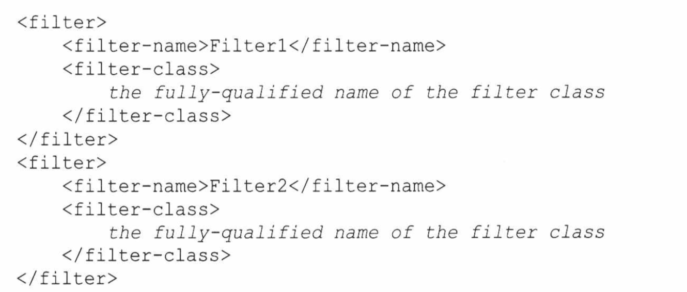
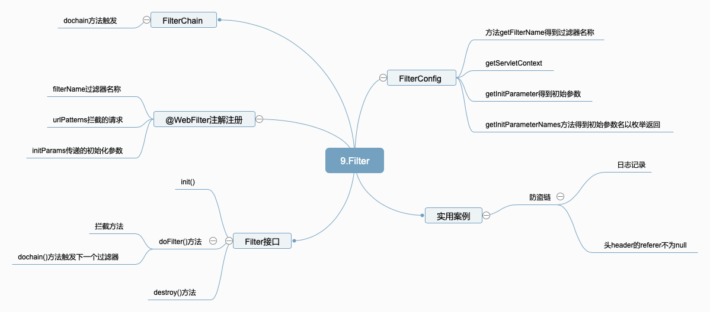

# 9.过滤器

过滤器是指拦截请求，并对传给被请求资源额ServletRequest或ServletResponse进行处理的一个对象，过滤器可以用于登陆、加密和解密、会话检查、图片转换等。

## 9.1 Filter API

 过滤器接口有Filter、FilterConfig和FilterChain

```java
public interface Filter {
	//过滤器启动服务时候时，调用该方法
    default void init(FilterConfig filterConfig) throws ServletException {
    }

	//每次调用过滤器使用该方法 var3.doFilter()一帮放在会后会调用下一个过滤器使用
    void doFilter(ServletRequest var1, ServletResponse var2, FilterChain var3) throws IOException, ServletException;

	//服务终止之前，方法会调用
    default void destroy() {
    }
}
```

## 9.2 过滤器的配置

​	配置过滤器的目标：

​	1，确定过滤器要拦截哪些资源

​	2.要传给过滤器init 方法的启动初始值	

​	3.给过滤器起名字

```java
public interface FilterConfig {
//获取过滤器名称
    String getFilterName();
//获取ServletContext
    ServletContext getServletContext();
//处理初始化参数的第二个方式
    String getInitParameter(String var1);
//获取初始参数以枚举方式返回
    Enumeration<String> getInitParameterNames();
}
```

​	配置过滤器方法：1使用@WebFilter注解2.在web.xml配置

@WebFilter属性

```java
public @interface WebFilter {
	//过滤器描述
    String description() default "";
	//过滤器显示名称
    String displayName() default "";
	//过滤器初始参数
    WebInitParam[] initParams() default {};
	//过滤器民财
    String filterName() default "";
    //过滤器的小图标名称
    String smallIcon() default "";
	//过滤器大图标名称
    String largeIcon() default "";
	//适用于过滤器Servlet名称
    String[] servletNames() default {};
	//应用于过滤器的URL模式
    String[] value() default {};
	//应用于过滤器的URL模式
    String[] urlPatterns() default {};
	//应用于过滤器的dispatcher类型
    DispatcherType[] dispatcherTypes() default {DispatcherType.REQUEST};

	//是和否支持异步操作模式
    boolean asyncSupported() default false;
}
```

## 9.3 日志过滤器

```java
package cn.edu.hust.filter;

import javax.servlet.*;
import javax.servlet.annotation.WebFilter;
import javax.servlet.annotation.WebInitParam;
import javax.servlet.http.HttpServletRequest;
import java.io.File;
import java.io.FileNotFoundException;
import java.io.IOException;
import java.io.PrintWriter;
import java.text.SimpleDateFormat;
import java.util.Date;
import java.util.Locale;

@WebFilter(filterName = "LoggingFilter",urlPatterns = "/*",initParams = {@WebInitParam(name="logFilfName",value="log.txt"),@WebInitParam(name="prefix",value="URI:")})
public class LoggingFilter implements Filter {
    private PrintWriter logger;
    private String prefix;
    @Override
    public void doFilter(ServletRequest servletRequest, ServletResponse servletResponse, FilterChain filterChain) throws IOException, ServletException {
        System.out.println("LoggingFilter.doFilter");
        HttpServletRequest httpServletRequest= (HttpServletRequest) servletRequest;
        logger.println(new SimpleDateFormat("yyyy-dd-MM HH:mm:ss", Locale.CHINA).format(new Date()).toString()+" "+prefix+httpServletRequest.getRequestURI());
        logger.flush();
        filterChain.doFilter(servletRequest,servletResponse);
    }

    @Override
    public void init(FilterConfig filterConfig) throws ServletException {
        prefix=filterConfig.getInitParameter("prefix");
        String logFileName=filterConfig.getInitParameter("logFilfName");
        String appPath=filterConfig.getServletContext().getRealPath("/");
        System.out.println("logFileName:"+logFileName);
        try
        {
            logger=new PrintWriter(new File(appPath,logFileName));
        } catch (FileNotFoundException e) {
            e.printStackTrace();
        }
    }

    @Override
    public void destroy() {
        System.out.println("destroying filter");
        if(logger!=null)
        {
            logger.close();
        }
    }
}
```

## 9.4 登陆过滤器

```java
package cn.edu.hust.filter;

import javax.servlet.*;
import javax.servlet.annotation.WebFilter;
import javax.servlet.annotation.WebInitParam;
import javax.servlet.http.HttpServletRequest;
import javax.servlet.http.HttpServletResponse;
import javax.servlet.http.HttpSession;
import java.io.IOException;

@WebFilter(filterName="LoginFilter",urlPatterns = "/*")
public class LoginFilter implements Filter{
    @Override
    public void init(FilterConfig filterConfig) throws ServletException {
        System.out.println("LoginFilter init");
    }

    @Override
    public void doFilter(ServletRequest servletRequest, ServletResponse servletResponse, FilterChain filterChain) throws IOException, ServletException {
        HttpServletRequest req= (HttpServletRequest) servletRequest;
        HttpServletResponse resp= (HttpServletResponse) servletResponse;
        HttpSession session=req.getSession();
        Object o=session.getAttribute("user");
        if(o==null)
        {
            req.getRequestDispatcher("/login.jsp").forward(req,resp);
            return;
        }
        //放行
        filterChain.doFilter(req,resp);
    }

    @Override
    public void destroy() {
        System.out.println("LoginFilter destroy");
    }
}
```

## 9.5 防盗链

```java
package cn.edu.hust.filter;

import javax.servlet.*;
import javax.servlet.annotation.WebFilter;
import javax.servlet.http.HttpServletRequest;
import javax.servlet.http.HttpServletResponse;
import java.io.IOException;

@WebFilter
public class RefererListener implements Filter{
    @Override
    public void init(FilterConfig filterConfig) throws ServletException {

    }

    @Override
    public void doFilter(ServletRequest servletRequest, ServletResponse servletResponse, FilterChain filterChain) throws IOException, ServletException {
        HttpServletRequest req= (HttpServletRequest) servletRequest;
        HttpServletResponse resp= (HttpServletResponse) servletResponse;
        String s=req.getHeader("referer");
        if(s==null)
        {
            throw new ServletException("images not availbale");
        }
        else
            filterChain.doFilter(req,resp);
    }

    @Override
    public void destroy() {

    }
}
```

## 9.6 过滤器



## 9.7 思维导图

